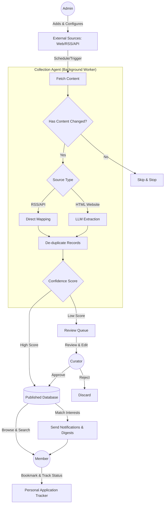

# Opportunity Radar - System Flow

This diagram illustrates how data moves through the system from the original external sources to the end-users (members), including the automated steps performed by the Collection Agent and the manual interventions by Admins and Curators.

